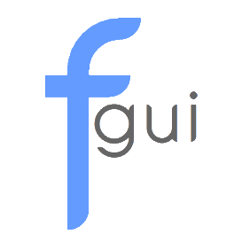

  

    
      

 
  

***

A multiplatform object-oriented gui framework written in **C++**. This framework is mainly aimed towards game hacking, but you can use it for anything you want.

* Easy to use and to customize.
* Works on multiple graphics libraries. (DirectX, OpenGL, Vulkan, etc)
* It comes with a built-in config system. (The framework is using [json](https://github.com/nlohmann/json) as a file parser.)
* Can handle multiple windows at the same time.

_You can visit the [wiki](https://github.com/iFloody/fgui/wiki) page for elements documentation and a how to setup guide._

***

Here is a preview of the default window design:

And as I said, the framework is very customizable. You can click [here](https://github.com/iFloody/fgui/tree/master/resources) for more examples.

If you find any bugs, glitches or if you have an feature request or you just want to give feedback, you can go on the issues tab. 
If you want to contribute, feel free to make a pull request. _(Make sure to follow the code style)_

<h4>Acknowledgments:</h4>

 [@Vulgar1s](https://github.com/Vulgar1s): Helped with some [elements](); [Containers](), [Textboxes](), and [Colorpickers](). He also helped with bug fixing and feedback.
 
 [@daanSayajin](https://github.com/daanSayajin): Bug fixing and feedback.
