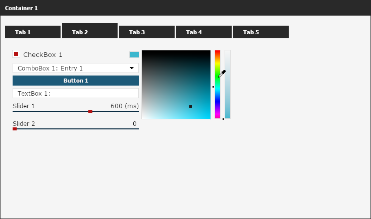
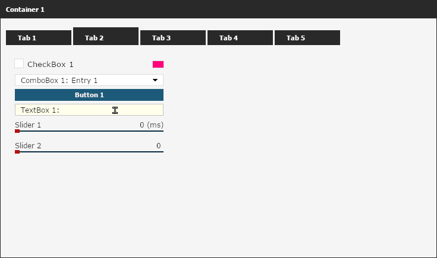

  

    
    

 
  

***

A multiplatform object-oriented gui framework written in **C++**. This framework is mainly aimed towards game hacking, but you can use it for anything.

	* Easy to use and to customize.
	* Works with DirectX 9/10 and Valve's DirectX 9 wrapper: Surface. (OpenGL will come later.)
	* It comes with a built-in config system. (The library is using json (https://github.com/nlohmann/json) as a file parser.)

You can visit the [wiki (currently under construction)](https://github.com/otvv/fgui/wiki) page for widgets, function documentation and a how to setup guide.

Here is some images of the default design of the library:

In this [link](https://github.com/otvv/fgui/tree/master/resources) you can see more examples of what you can do with FGUI.

If you find bugs or glitches feel free to visit the issues tab or report it on the Discord server. 
If you want to contribute, you can always make a pull request.
